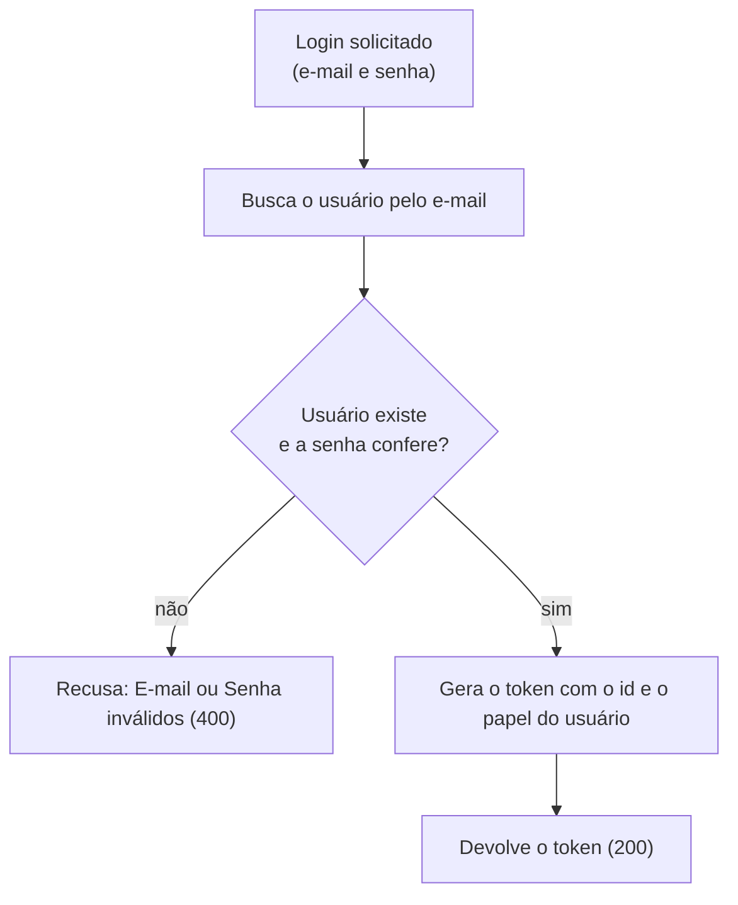

# Login

## Objetivo
Autenticar o usuário com e-mail e senha e devolver um token de acesso.

## Diagrama

## Regras
- E-mail inexistente e senha incorreta geram a mesma recusa, "E-mail ou Senha inválidos.", sem indicar qual dos dois errou.
- O token identifica o usuário (id) e o papel (Cliente, Restaurante ou Entregador).
- O token tem prazo de validade, definido na configuração do sistema.
- Uma recusa não gera token.

Regras do módulo: [Autenticação](../autenticacao.md).
