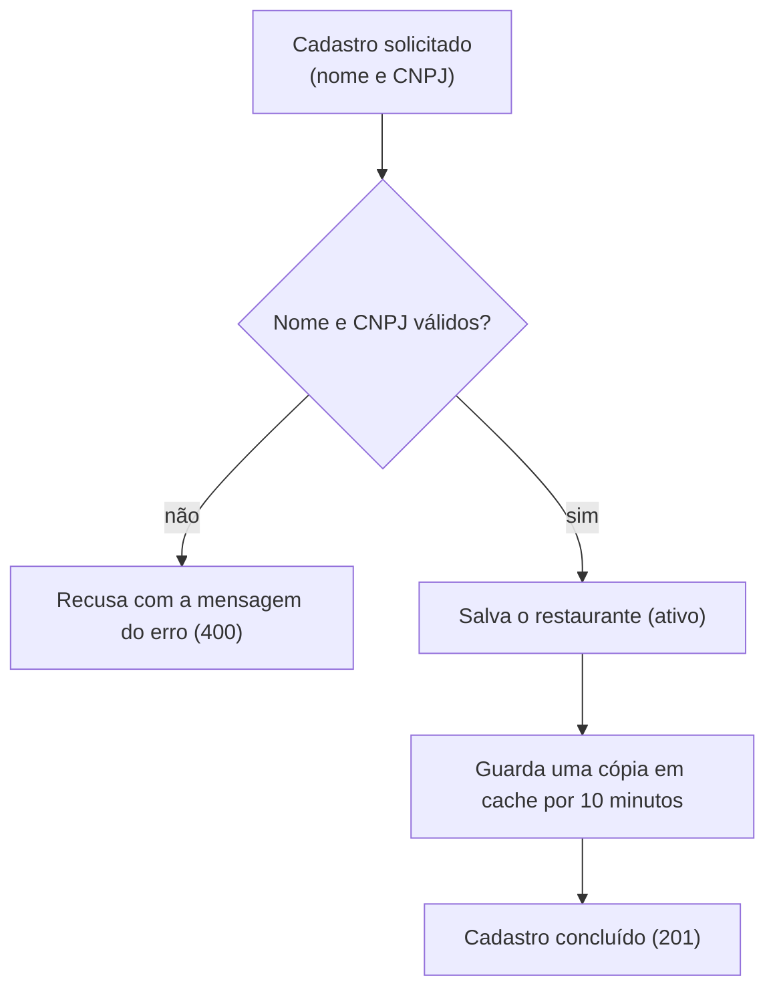

# Cadastro de restaurante

## Objetivo
Registrar um novo restaurante com nome e CNPJ.

## Diagrama

## Regras
- O nome não pode ficar em branco: "Nome inválido."
- O CNPJ precisa ter exatamente 14 dígitos numéricos: "Cnpj inválido."
- Com mais de um erro, as mensagens vêm juntas, separadas por quebra de linha.
- O restaurante cadastrado nasce ativo.
- A cópia em cache é guardada depois de salvar e dura 10 minutos.
- Um cadastro recusado não cria o restaurante.

Regras do módulo: [Catálogo](../catalogo.md).
