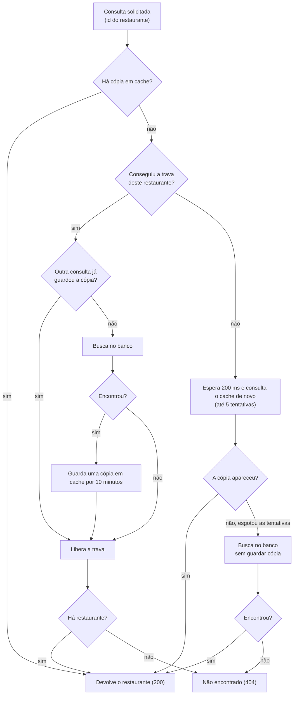

# Consulta de restaurante

## Objetivo
Devolver os dados de um restaurante a partir do seu id, com consulta rápida e sem sobrecarregar o banco quando várias consultas chegam juntas.

## Diagrama

## Regras
- O cache é consultado primeiro. Se houver cópia, ela é devolvida sem ir ao banco.
- Sem cópia, só uma consulta por vez busca o mesmo restaurante no banco: a que consegue a trava. A trava dura no máximo 5 segundos e é liberada ao final, com ou sem sucesso.
- Quem consegue a trava confere o cache mais uma vez antes de ir ao banco, porque outra consulta pode ter guardado a cópia nesse intervalo.
- Quem não consegue a trava espera 200 ms e consulta o cache de novo, até 5 vezes (cerca de 1 segundo no total).
- Esgotadas as 5 tentativas sem cópia, o restaurante é buscado direto no banco, sem trava e sem guardar cópia. A resposta tem prioridade sobre evitar a busca repetida.
- Quando o restaurante é encontrado com a trava, uma cópia é guardada por 10 minutos.
- Restaurante inexistente retorna 404, sem corpo, e nenhuma cópia é guardada.
- A resposta traz o id, o nome, o CNPJ e se o restaurante está ativo.
- A consulta não altera o restaurante.

Regras do módulo: [Catálogo](../catalogo.md).
