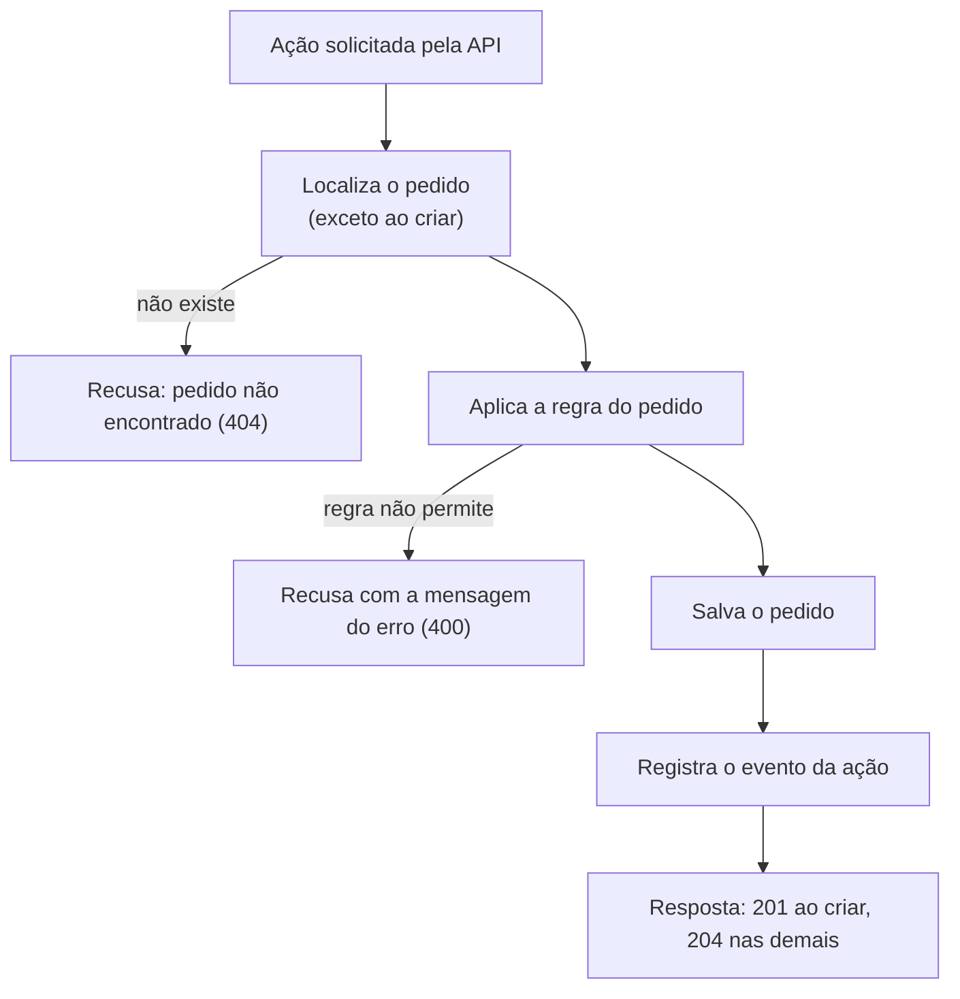

# O que acontece a cada ação

## Objetivo
Mostrar o caminho de qualquer ação sobre o pedido (criar, adicionar item ou mudar de etapa), do pedido da API até o registro.

## Diagrama

## Regras
- Uma ação recusada não altera o pedido.
- O evento só é registrado depois que o pedido é salvo.
- Ao localizar o pedido, seus itens são carregados junto.

Ordem das chamadas e erros: [Integrar com Pedidos](../api/pedidos-api.md).
