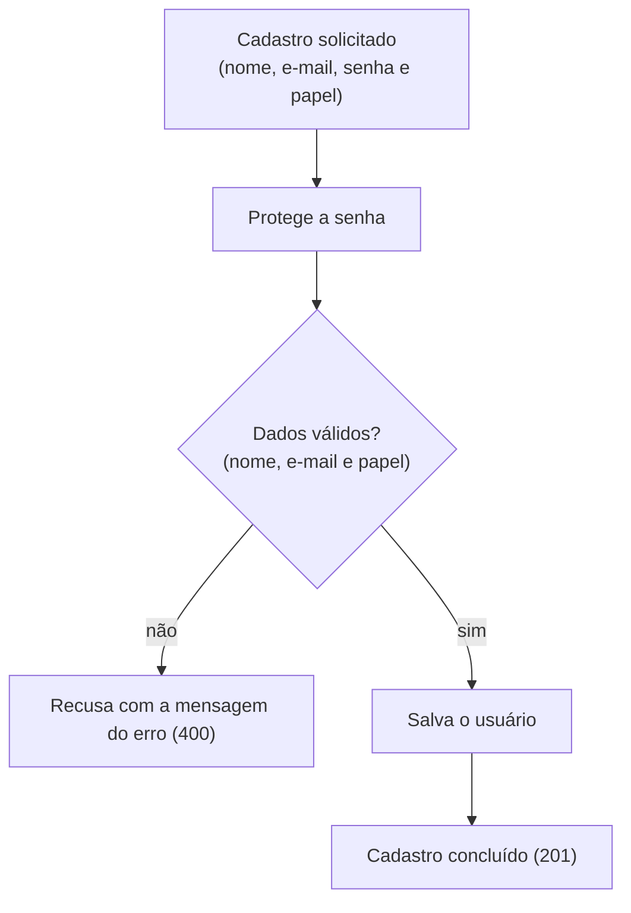

# Cadastro de usuário

## Objetivo
Registrar um novo usuário com nome, e-mail, senha e papel.

## Diagrama

## Regras
- O nome não pode ficar em branco: "Nome inválido."
- O e-mail precisa ter formato válido: "E-mail inválido."
- O papel precisa ser Cliente, Restaurante ou Entregador.
- Com mais de um erro, as mensagens vêm juntas, separadas por quebra de linha.
- Um cadastro recusado não cria o usuário.

Regras do módulo: [Autenticação](../modulos/autenticacao/autenticacao.md).
