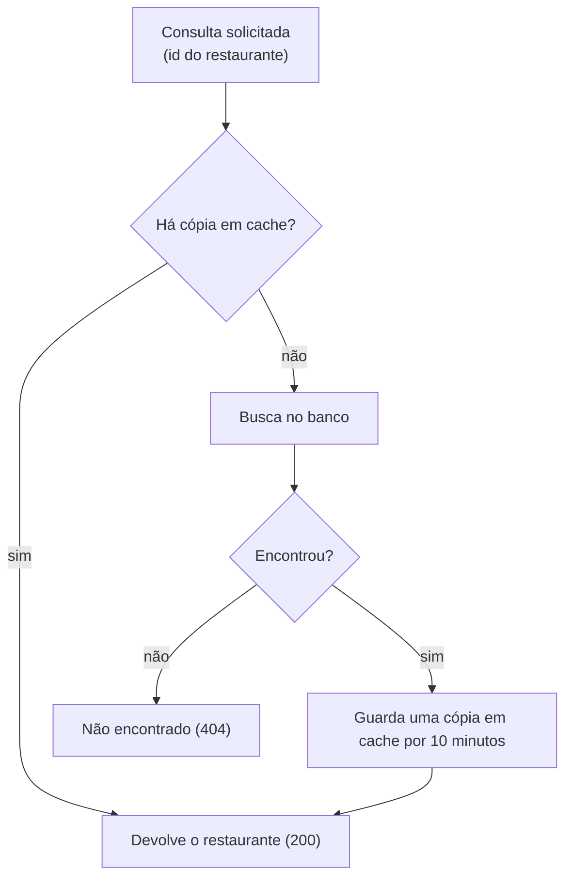

# Consulta de restaurante

## Objetivo
Devolver os dados de um restaurante a partir do seu id, com consulta rápida quando possível.

## Diagrama

## Regras
- O cache é consultado primeiro. Se houver cópia, ela é devolvida sem ir ao banco.
- Sem cópia, o restaurante é buscado no banco e, se existir, uma cópia é guardada por 10 minutos.
- Restaurante inexistente retorna 404, sem corpo.
- A resposta traz o id, o nome, o CNPJ e se o restaurante está ativo.
- A consulta não altera o restaurante.

Regras do módulo: [Catálogo](../modulos/catalogo/catalogo.md).
