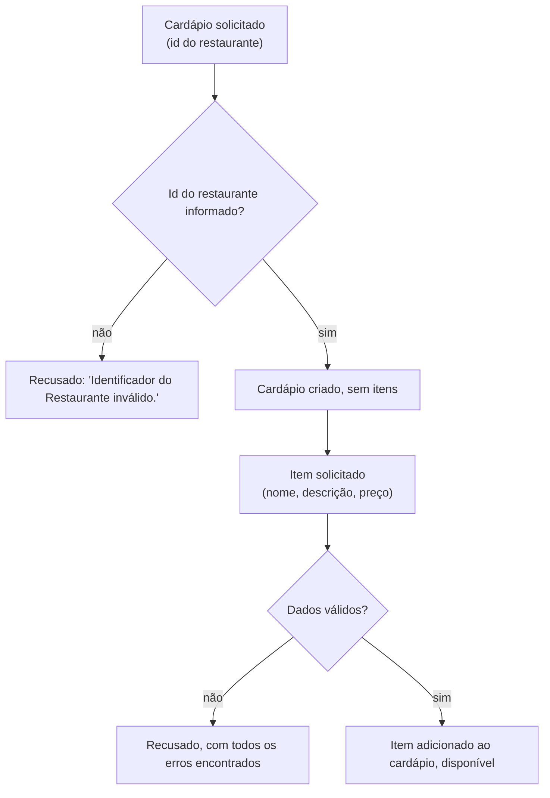

# Montagem de cardápio

## Objetivo
Criar o cardápio de um restaurante e adicionar itens a ele.

> ⚠️ **Atenção:** o sistema ainda não tem rotas para cardápio nem para itens. Estas são as regras já previstas para quando existirem.

## Diagrama

## Regras
- O cardápio nasce vazio e pertence a um restaurante.
- O id do restaurante é obrigatório. Não é conferido se o restaurante existe.
- Os itens são adicionados um a um, sempre por meio do cardápio.
- Todo item tem nome e descrição obrigatórios.
- O preço do item não pode ser negativo.
- O item nasce disponível.
- Se houver mais de um dado inválido, todos os erros são devolvidos juntos.

Regras do módulo: [Catálogo](../modulos/catalogo/catalogo.md).
