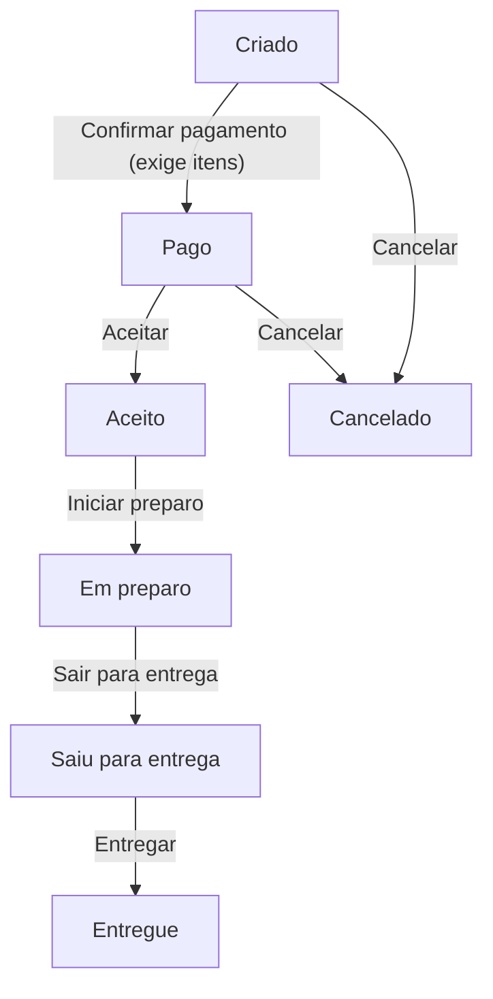

# Etapas do pedido

## Objetivo
Levar o pedido de Criado até Entregue, ou Cancelado.

## Diagrama

## Regras
- Itens só podem ser adicionados na etapa Criado.
- Uma ação fora do diagrama é recusada com uma mensagem e o pedido continua na mesma etapa.
- Toda ação bem-sucedida é registrada como um evento do pedido, inclusive a criação e a adição de item.
